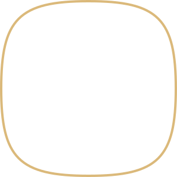

<!-- HEADER: Menggunakan Custom Banner & Profile Photo -->

 

<!-- FOTO PROFIL DALAM BINGKAI -->

  

    
    
  

 

  

<!-- GITHUB STATS BADGES -->

  

<!-- ═══════════════════════════════════════════════════════════
     SECTION — ABOUT ME
     ═══════════════════════════════════════════════════════════ -->

## &nbsp; About Me

> **Bridging the gap between intuitive UI/UX design and scalable full-stack engineering.**

<table>
<tr>
<td width="60%" valign="top">

I'm **Naufal**, a software engineer who works across the full stack but genuinely loves the intersection of **frontend engineering** and **UI/UX design** — the point where a clean, wireframed interface meets code that doesn't fall apart in production.

Most of my time goes into three things:

*   🧩 **Building** — Web applications with an emphasis on structure, maintainability, and user interfaces that don't need explaining.
*   🎨 **Designing** — Crafting wireframes, exploring font layouts, and building interface systems in Figma before a single line of code is written.
*   📈 **Planning** — Mapping projects with Gantt charts and task-dependency diagrams before development starts, not after things go sideways.

Currently deepening my backend skills to own projects end-to-end — from database schema to the final pixel on the screen.

</td>
<td width="40%" valign="top" align="center">

 
 

</td>
</tr>
</table>

 

<!-- ═══════════════════════════════════════════════════════════
     SECTION — QUICK INFO
     ═══════════════════════════════════════════════════════════ -->

## &nbsp; Quick Info

| | |
|:---|:---|
| 🧑‍💻 **Name** | Naufal Adriananta Halim |
| 🎯 **Role** | Web Developer & UI/UX Designer |
| 📍 **Location** | Indonesia |
| 📧 **Email** | [naufalandriananta@gmail.com](mailto:naufalandriananta@gmail.com) |
| 📱 **WhatsApp** | [+62 822-6401-6836](https://wa.me/6282264016836) |
| 📸 **Instagram** | [@nfltaa\_](https://instagram.com/nfltaa_) |
| 💼 **LinkedIn** | [naufal\_\_](https://linkedin.com/in/naufal__) |
| 🤝 **Collaboration** | Always open to web development & UI/UX projects |

 

<!-- ═══════════════════════════════════════════════════════════
     SECTION — TECH STACK
     ═══════════════════════════════════════════════════════════ -->

## &nbsp; Tech Stack & Tools

<b>Languages & Frontend</b>

 

<b>Backend & Database</b>

 

<b>Design & Workflow</b>

 

 

<!-- ═══════════════════════════════════════════════════════════
     SECTION — GITHUB DASHBOARD
     ═══════════════════════════════════════════════════════════ -->

## &nbsp; GitHub Dashboard

 

 

<!-- ═══════════════════════════════════════════════════════════
     SECTION — FEATURED PROJECTS
     ═══════════════════════════════════════════════════════════ -->

## &nbsp; Featured Projects

